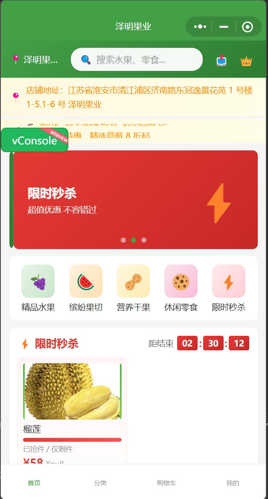
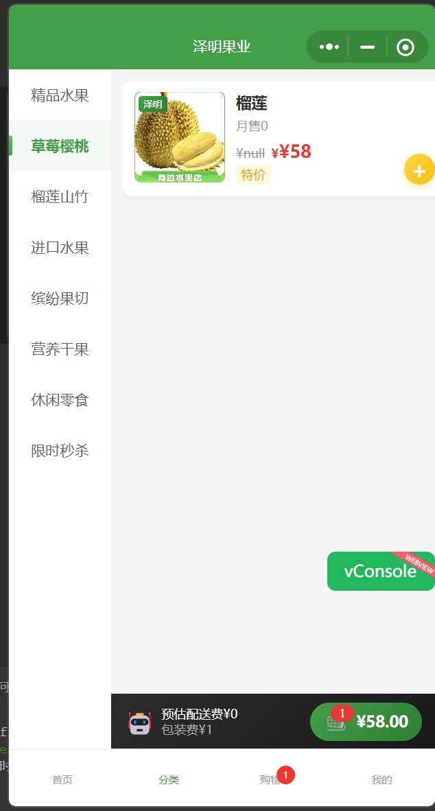
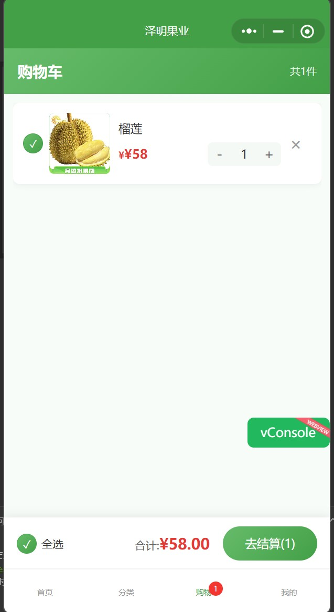
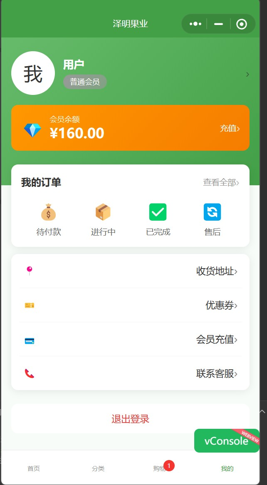

# 🍎 泽明果业 - 微信小程序商城

> 基于**微信云开发**的全栈水果电商小程序，涵盖用户端与管理端完整业务流程。

## 📱 项目概览

一款面向线下水果店的微信小程序商城解决方案，支持到店自取与送货上门两种配送模式，集成微信支付、配送范围计算、后台管理等核心功能。

## 📸 界面预览

| 首页 | 分类浏览 |
|:---:|:---:|
|  |  |

| 购物车 | 个人中心 |
|:---:|:---:|
|  |  |

## 🛠 技术栈

| 类别 | 技术 |
|------|------|
| 前端框架 | 微信小程序原生开发 |
| 后端服务 | 微信云开发（CloudBase） |
| 数据库 | 云开发 NoSQL 数据库 |
| 支付集成 | 微信支付 JSAPI（cloud.cloudPay） |
| 地图服务 | 腾讯地图 WebService API |
| 运行环境 | Node.js 12+（云函数） |

## ✨ 核心功能

### 用户端
- 🏠 **首页** - 轮播图、公告栏、秒杀专区、热门商品推荐
- 📂 **分类浏览** - 按品类筛选商品
- 🛒 **购物车** - 商品增删、数量调整、全选结算
- 📦 **订单流程** - 配送方式选择、地址管理、优惠券、订单提交
- 💳 **微信支付** - 真实微信支付集成，支付回调自动更新订单
- 📍 **智能配送** - 基于腾讯地图计算驾车距离，自动判断配送范围与费用
- 👤 **个人中心** - 会员等级、余额管理、订单查询、地址管理
- 🔐 **隐私合规** - 弹窗式隐私协议确认，符合微信审核规范

### 管理端
- 📊 **数据看板** - 订单统计、销售额分析
- 📦 **商品管理** - Excel 批量导入商品
- 🎫 **优惠券管理** - 创建、查看优惠券
- 👥 **管理员管理** - 角色权限控制
- ⚙️ **店铺设置** - 公告、配送、店铺信息动态配置（无需发版）

## 🏗 项目架构

```
zeming-fruits/
├── pages/                    # 小程序页面
│   ├── index/               # 首页
│   ├── category/            # 分类页
│   ├── cart/                # 购物车
│   ├── mine/                # 个人中心
│   ├── login/               # 登录（手机号快捷登录）
│   ├── order/pay            # 下单支付页
│   ├── orders/              # 订单列表
│   ├── orderDetail/         # 订单详情
│   ├── address/             # 地址管理
│   ├── recharge/            # 会员充值
│   ├── admin/               # 管理入口
│   ├── admin-dashboard/     # 数据看板
│   ├── admin-settings/      # 店铺设置
│   ├── admin-managers/      # 管理员管理
│   ├── admin-product/       # 商品管理
│   └── coupon-admin/        # 优惠券管理
├── cloudfunctions/           # 云函数
│   ├── payOrder/            # 微信支付统一下单
│   ├── payCallback/         # 支付结果回调处理
│   ├── saveSettings/        # 店铺设置保存（管理员鉴权）
│   ├── decryptPhone/        # 手机号解密
│   ├── userLogin/           # 用户登录
│   ├── calculateOrder/      # 订单费用计算
│   ├── getOpenId/           # 获取用户OpenID
│   └── parseExcel/          # Excel商品导入解析
├── utils/                    # 工具模块
│   ├── tencentMap.js        # 腾讯地图封装（距离计算、地理编码）
│   └── util.js              # 通用工具函数
├── config/                   # 敏感配置（已加入 .gitignore）
├── config.example/           # 配置模板
├── cloud/                    # 云数据库权限配置
├── app.js                    # 小程序入口
└── app.json                  # 全局配置
```

## 🔑 核心技术实现

### 微信支付流程
```
用户下单 → payOrder云函数 → cloud.cloudPay.unifiedOrder → 返回支付参数
    → wx.requestPayment 拉起支付 → 用户完成支付
    → 微信回调 payCallback云函数 → 更新订单状态 & 用户统计
```

### 配送范围计算
- 调用腾讯地图 Distance Matrix API 获取**驾车距离**（非直线距离）
- 超出 3km 自动提示超出配送范围
- 配送费根据距离动态计算

### 隐私合规
- 登录/支付前弹出隐私协议弹窗，提供"同意"和"不同意"选项
- 用户必须主动点击同意，不得默认勾选
- 符合微信小程序隐私政策审核要求

### 管理员权限控制
- 云函数层进行 OpenID 鉴权，非管理员无法修改数据
- 前端页面根据角色动态显示管理入口

## 🚀 快速开始

### 1. 克隆项目
```bash
git clone https://github.com/你的用户名/zeming-fruits.git
```

### 2. 配置敏感信息
```bash
# 复制配置模板
cp -r config.example/ config/

# 编辑配置文件，填入你的密钥
# config/location-config.json  → 腾讯地图 Key
# config/wechat-pay-config.json → 商户号、管理员OpenID
```

### 3. 导入微信开发者工具
- 打开微信开发者工具 → 导入项目 → 选择项目目录
- 填入你的 AppID
- 云函数目录右键 → 上传并部署：云端安装依赖

### 4. 创建数据库集合
在云开发控制台创建以下集合：
`users` `products` `orders` `coupons` `settings` `managers` `recharge_records`

## 📄 License

MIT License
